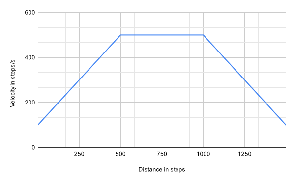
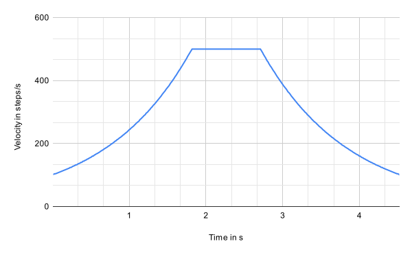

# ExcelStepper

**ExcelStepper** is an excellent Arduino library for stepper motor control, offering simplicity, speed, and precise acceleration for smooth movement.


## Features
- **Acceleration between speeds** within a given distance
- **Jump between speeds**
- **Faster speeds** thanks to low computations
- **Non-blocking** for multitasking
- **Multiple steppers**


## Usage
``` cpp
#include <ExcelStepper.h>

ExcelStepper stepper(2, 5);  // Create a new stepper motor on pins 2 and 5.

void setup() {
    Serial.begin(115200);

    stepper.begin();                                       // Set up the stepper motor.
    stepper.setDirection(ExcelStepper::COUNTERCLOCKWISE);  // Set the direction of the motor.
}

void loop() {
    stepper.accelerate(800, 500);  // Accelerates from 0 to 800 steps per second in 500 steps.
    stepper.runToTarget();         // Waits for the motor to reach 500 steps.

    stepper.move(500);  // Moves 500 steps at 800 steps per second.

    while (!stepper.run()) {                      // Loops until the motor has reached the target position.
        Serial.println(stepper.currentSpeed());  // Large computations like serial prints may slow down the motor.
    }

    // Accelerate from 800 to 1600 steps per second in 500 steps.
    stepper.accelerate(1600, 500);
    stepper.runToTarget();

    // Jump from 1600 to 800 steps per second.
    stepper.jumpToSpeed(800);
    stepper.move(500);
    stepper.runToTarget();

    // Decelerate to 0 steps per second in 1000 steps.
    stepper.decelerate(0, 1000);
    stepper.runToTarget();

    delay(1000);
}
```

## Limitations
- To improve speed, ExcelStepper does not check for existing PWM on the step pin. Use with caution!
- Jumping to high speeds may not work due to physics. Use acceleration in such cases.
- Very long accelerations may not work due to physics. Here are possible solutions:
    - Set a higher minumum speed.
        ``` cpp
        ExcelStepper stepper(2, 5, YOUR_MIN_SPEED);
        ```
    - Split your sequence into multiple accelerations where the first is the highest.
    - A mixture of both.
- In order to reduce computation time, changes in acceleration are not smooth. But see for yourself in the charts below.
- ExcelStepper uses `micros()` for exact timing. `micros()` resets after about 70 minutes which may cause a step to trigger too soon.

## Charts
The following charts were created using this demo sequence and a minimum speed of `100 steps/s`:
``` cpp
#include "ExcelStepper.h"

ExcelStepper stepper(2, 5, 100);

void setup() {
    stepper.begin();

    stepper.accelerate(500, 500);
    stepper.runToTarget();

    stepper.move(500);
    stepper.runToTarget();

    stepper.decelerate(0, 500);
    stepper.runToTarget();
}
```
### Velocity over distance


### Velocity over time


## Details

### Minimum Speed Constraints
At very low speeds, intervals between steps become long. For instance, a speed of 0 steps per second would require an infinite interval. Additionally, motors have a minimum operational speed below which they cannot function properly. To ensure reliability, we calculate speed such that it never drops below this minimum threshold. To stop the motor, we simply stop triggering steps.

You can set the `minSpeed` in the constructor:
``` cpp
ExcelStepper stepper(2, 5, YOUR_MIN_SPEED);
```

### Increasing Speed Efficiency
#### Minimizing Float Usage
Floating-point operations are computationally expensive. By limiting precision to two decimal places, we can multiply values by 100 and work with integers, significantly improving performance.

#### Reducing Computation in `run()`
To streamline `run()`, we calculate acceleration only once, when `accelerate()` is called. In `run()`, speed is updated using a straightforward formula:
```
speed = targetSpeed - (acceleration x stepsRemaining) / 100
```
*(where all variables are integers)*

This ensures the target speed is achieved within the specified number of steps, even if step intervals are slightly imprecise. Although this approach appears to implement constant acceleration, intervals between steps naturally decrease as speed increases.

#### Optimizing `digitalWrite()` by Removing Redundant Checks
Arduino's `digitalWrite()` includes various checks for safety, but these can slow down execution. By identifying and removing unnecessary checks, we can improve performance. One such check is for PWM on the pin. Since we assume the user won't enable PWM on a motor control pin, we can safely bypass this check for faster operation.

## Contributions Welcome

We're open to contributions, especially for improvements in speed and efficiency. Feel free to open issues or pull requests with optimizations, feature requests, or bug reports to help make this project even better. Your input is valuable and appreciated!